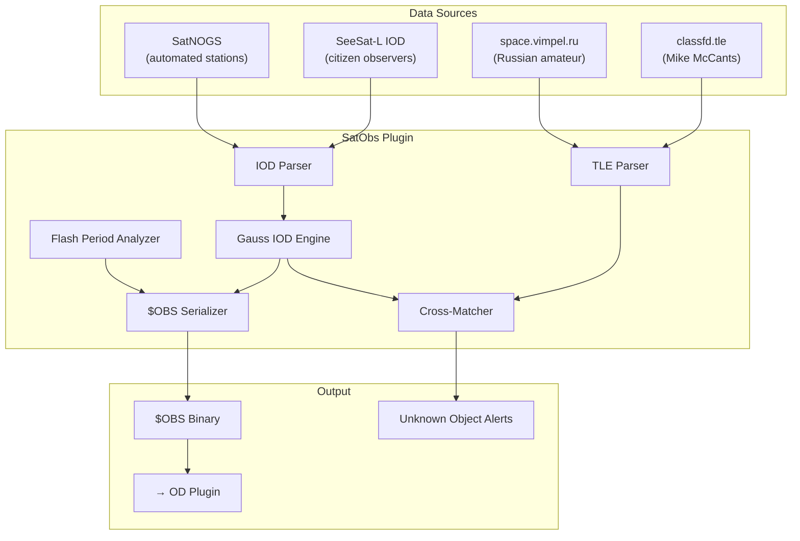

# 🔭 Satellite Observation & OD Plugin

[](https://github.com/the-lobsternaut/satobs-sdn-plugin/actions)
[](LICENSE)
[](https://en.cppreference.com/w/cpp/17)
[](https://github.com/the-lobsternaut)

**Citizen space surveillance — ingests IOD observations from SeeSat-L, classified TLE catalogs, and SatNOGS. Parses positional observations, performs Gauss angles-only orbit determination, and cross-matches to classified/untracked objects with photometric flash period analysis.**

---

## Overview

The SatObs plugin bridges the citizen satellite observer community with the Space Data Network, enabling:

- **IOD format parsing** — International Optical Description format from SeeSat-L observers
- **Classified TLE ingestion** — Mike McCants' classfd.tle, space.vimpel.ru catalogs
- **SatNOGS observations** — automated ground station positional data
- **Gauss IOD** — angles-only initial orbit determination from optical observations
- **Flash period analysis** — photometric brightness variations for tumble characterization
- **Cross-matching** — correlate observations to known catalog objects or flag as unknown

---

## Architecture



---

## Data Sources & APIs

| Source | URL | Type | Description |
|--------|-----|------|-------------|
| **SeeSat-L** | [satobs.org/seesat](http://www.satobs.org/seesat/) | Mailing list | Citizen observer IOD reports |
| **McCants classfd.tle** | [prismnet.com/~mmccants/classfd.tle](https://www.prismnet.com/~mmccants/classfd.tle) | Text file | Classified object TLEs |
| **Vimpel** | [space.vimpel.ru](http://space.vimpel.ru/) | Web | Russian amateur observations |
| **SatNOGS** | [satnogs.org](https://satnogs.org/) | REST | Automated ground station network |

---

## Research & References

- Vallado, D. A. (2013). *Fundamentals of Astrodynamics and Applications*. Ch. 7 — Initial Orbit Determination.
- **IOD Format** — International Optical Description format. [satobs.org](http://www.satobs.org/).
- McCants, M. M. "Classified Satellite TLE Archive." Long-running community catalog of classified objects.
- Molotov, I. et al. (2009). ["ISON Network for Space Debris Monitoring"](https://doi.org/10.1016/j.asr.2008.09.014). *Advances in Space Research*. Russian space surveillance network.

---

## Build Instructions

```bash
git clone --recursive https://github.com/the-lobsternaut/satobs-sdn-plugin.git
cd satobs-sdn-plugin
mkdir -p build && cd build
cmake ../src/cpp -DCMAKE_CXX_STANDARD=17
make -j$(nproc) && ctest --output-on-failure
```

---

## Plugin Manifest

```json
{
  "schemaVersion": 1,
  "name": "satobs-od",
  "version": "0.1.0",
  "description": "Satellite Observation & OD — citizen surveillance data ingestion, IOD parsing, Gauss OD, flash period analysis.",
  "author": "DigitalArsenal",
  "license": "Apache-2.0",
  "inputFormats": ["text/plain", "application/json"],
  "outputFormats": ["$OBS"]
}
```

---

## License

Apache-2.0 — see [LICENSE](LICENSE) for details.

*Part of the [Space Data Network](https://github.com/the-lobsternaut) plugin ecosystem.*
